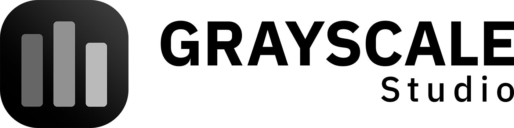

<!-- markdownlint-disable MD033 -->

    <picture>
        <source media="(prefers-color-scheme: dark)" srcset="public/assets/branding/graycale-studio-full-logo-negativo.png" />
        <source media="(prefers-color-scheme: light)" srcset="public/assets/branding/graycale-studio-full-logo.png" />
        
    </picture>

<strong>Economía circular al alcance de tu comunidad</strong>

  

<!-- markdownlint-enable MD033 -->

> Aplicación web profesional para la expansión y ecualización de histogramas de imágenes en escala de grises, construida bajo los principios de Clean Architecture y Domain-Driven Design (DDD).

---

## Descripción

**GrayScale Studio** es una moderna herramienta web diseñada para procesar imágenes en blanco y negro (JPG/JPEG). Validando matemáticamente que la imagen carezca de canales de color, el sistema extrae las frecuencias de intensidades (0-255), renderiza el histograma original y permite aplicar transformaciones de contraste no lineales (Ecualización) y lineales (Expansión Min-Max).

El proyecto destaca por su rigurosa arquitectura de software basada en Vanilla JavaScript, separando la lógica de negocio pura de las implementaciones de UI (DOM) y de las librerías matemáticas y gráficas.

---

## Características Implementadas

- **Carga Intuitiva:** Interfaz Drag & Drop o selección manual clásica para archivos locales.
- **Validación Estricta de Color:** Uso de OpenCV.js para verificar las diferencias cromáticas entre canales. Las imágenes con color son rechazadas instantáneamente protegiendo la integridad de la lógica de grises.
- **Procesamiento Asíncrono:** Bloqueo de UI coordinado. El usuario no puede interactuar hasta que el motor WebAssembly de OpenCV esté montado.
- **Ecualización de Histograma:** Redistribución plana de intensidades mediante `cv.equalizeHist`.
- **Expansión de Histograma (Min-Max):** Estiramiento lineal del rango dinámico utilizando `cv.normalize`.
- **Renderizado de Gráficos:** Visualización de Histogramas comparativos en tiempo real (Original vs Procesado) renderizados eficientemente con **Chart.js**, evitando fugas de memoria mediante la gestión de ciclo de vida de los lienzos.

---

## Tecnologías y Librerías

| Tecnología | Rol en la Arquitectura |
|---|---|
| **HTML5 / CSS3** | Capa de Presentación (UI y estructura) |
| **Vanilla JavaScript (ES6 Modules)** | Capas de Dominio, Aplicación e Infraestructura |
| **[OpenCV.js](https://docs.opencv.org/4.x/d5/d10/tutorial_js_root.html) (CDN)** | Motor matemático (Infraestructura). Inyectado mediante WebAssembly. |
| **[Chart.js](https://www.chartjs.org/) (CDN)** | Renderizado interactivo de datos de histograma (Infraestructura). |

---

## Arquitectura del Proyecto (DDD + SOLID)

El código fuente está estrictamente dividido en **4 capas lógicas**, asegurando un alto grado de cohesión y un bajo acoplamiento:

`
(insertar arquitectura interna)
`

- **Inversión de Dependencias (DIP):** El controlador principal delega la renderización visual a `ChartJsRenderer` instanciado desde el Composition Root, y los procesadores de dominio obligan a la infraestructura a cumplir contratos (`IImageProcessor`).

---

## Inicio Rápido (Desarrollo)

Dado que la aplicación utiliza **Módulos ES6** nativos (`<script type="module">`), debe ejecutarse desde un servidor HTTP local para evitar restricciones de políticas CORS impuestas por los navegadores modernos sobre el sistema de archivos `file://`.

1. **Clona este repositorio o abre la carpeta en tu editor.**
2. **Inicia un servidor local estático.** Varias opciones:
   - Extensión **Live Server** en VS Code.
   - Usando Node.js: `npx http-server` o `npx serve .`
   - Usando Python: `python -m http.server 3000`
3. **Navega a la URL local** provista (ej. `http://127.0.0.1:3000`).

---

## Instrucciones de Uso

1. Arrastra una fotografía **exclusivamente en escala de grises** (.jpg / .jpeg) a la zona delimitada.
2. Si subes una imagen con color, el panel de notificaciones bloqueará la operación con un recuadro de Error nativo.
3. Al aceptar una imagen válida, el área de trabajo se revelará mostrando tu fotografía original, sus metadatos (píxeles, rango) y su gráfico dinámico correspondiente.
4. Utiliza los controles superiores para ejecutar **"Ecualizar Histograma"** o **"Expandir Histograma"**.
5. Disfruta de la métrica comparativa renderizada al lado derecho de la pantalla. Puedes alternar repetidamente entre las operaciones.

---

